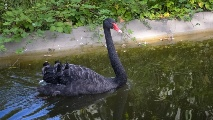
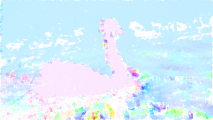
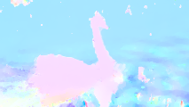
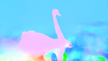
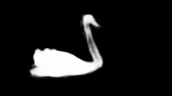
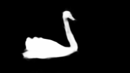
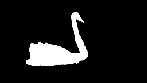
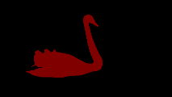
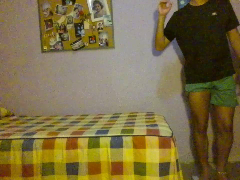
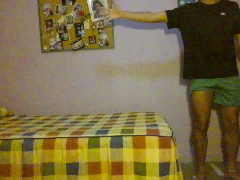

# TFG - Navegación visual con drones

En este trabajo tratamos de implementar de la detección de objetos que se mueven de forma independiente respecto al fondo en el que se encuentran, también conocidos como *IMO*s.

Para ello, hacemos uso del código desarrollado en el proyecto [MATNet](https://github.com/tfzhou/MATNet) y comparamos la estimación del flujo óptico utilizada aquí respecto a otros métodos de la literatura.

Por último, intentamos integrar el modelo que obtiene mejores resultados en una plataforma móvil, en nuestro caso, un dron.

## 1. Instalación

Para instalar este proyecto tienes que llevarte el proyecto a local:
```
git clone https://github.com/Najib8/TFG--Navegacion_visual_con_drones.git

cd TFG--Navegacion_visual_con_drones
```

Para ejecutar los scripts de este proyecto, he utilizado un entorno de conda al que le instalo los paquetes de la siguiente forma:

1. Crear el entorno:
```
conda create -n 'nombre_del_entorno'
```

2. Activar el entorno creado:
```
conda activate 'nombre_del_entorno'
```

3. Instalar `python 3.6.13` en el entorno de conda activo:
```
conda install python=3.6.13
```

4. Instalar los requerimientos definidos en el `requirements.txt` sobre `pip` del entorno de conda activo:
```
pip install -r requirements.txt
```

5. Instalar `cupy 8.3.0` en el entorno de conda activo:
```
conda install cupy=8.3.0
```

6. Instalar `pytorch 1.4.0` en el entorno de conda activo:
```
conda install pytorch=1.4.0
```

Ya tenemos todos los paquetes instalados para poder ejecutar todos los scripts correctamente.


## 2. Preparación del código y de las secuencias de imágenes

Para poder ejecutar los scripts necesitamos tener las secuencias de imágenes preparadas.
Tenemos dos opciones: utilizar el conjunto de datos DAVIS2017 o 
las imágenes en tiempo real que nos ofrece un dron (al que deberemos estar conectados).
Además los códigos para ejecutar estas dos opciones son levemente diferentes: para DAVIS2017, el código está en la rama `evaluacion-davis` y, para las imágenes del dron, en la rama `stream-dron`.

- A) Opción para ejecutar los scripts sobre **DAVIS2017**:

  Primero nos tenemos que traer a local la rama `evaluacion-davis`.
  ```
  git fetch TFG--Navegacion_visual_con_drones
  git branch evaluacion-davis TFG--Navegacion_visual_con_drones/evaluacion-davis
  ```
    
  Una vez tenemos el código correcto en local, nos tenemos que descargar el conjunto de imágenes [DAVIS2017](https://davischallenge.org/davis2017/code.html) y situarlo correctamente en el sistema de archivos:
  ```
  cd MATNet/data
  ln -s ruta_del_DAVIS2017_descargado DAVIS2017
  ```
    
  Por último, sólo queda descargarnos los [modelos con los pesos preentrenados](https://drive.google.com/file/d/1XlenYXgQjoThgRUbffCUEADS6kE4lvV_/view), descomprimirlos y situarlos correctamente en el sistema de archivos:
  ```
  cd ../ckpt/MATNet
  mv ruta_de_los_modelos_descomprimidos/*.pt .
  ```

- B) Opción para ejecutar los scripts sobre imágenes en tiempo real del dron:

  Primero nos tenemos que traer a local la rama `stream-dron`.
  
  ```
  git fetch TFG--Navegacion_visual_con_drones
  git branch stream-dron TFG--Navegacion_visual_con_drones/stream-dron
  ```

  El dron utilizado en este proyecto es el DJI Tello Ryzen y para gestionar la comunicación con él hemos utilizado la librería [DJITelloPy](https://github.com/damiafuentes/DJITelloPy).
  Por tanto, es necesario que instalemos esta librería así como sus dependencias.
  ```
  pip3 install djitellopy
  pip3 install opencv-python-headless==4.1.2.30
  ```

  Por último, necesitamos encender el dron Tello y conectarnos vía Wi-Fi al mismo.


## 3. Ejecución de los scripts

Con los modelos y las secuencias de imágenes correctamente instaladas, solo tenemos que correr los scripts diferentes scripts.

- A) Opción para ejecutar los scripts sobre **DAVIS2017**:

  ### Estimación del flujo óptico

  Desde el directorio raiz del proyecto ejecutamos:
  ```
  python3 ./MATNet/3rdparty/pytorch_pwc/run_davis_flow.py
  ```
  Este scipt almacenará los flujos ópticos de las secuencias de DAVIS2017 en el directorio `./MATNet/data`.

  ### Segmentación del *IMO*
  
  Desde el directorio raiz del proyecto ejecutamos:
  ```
  python3 ./MATNet/test_MATNet.py
  ```
  Este scipt almacenará las segmentaciones de los *IMO*s de las secuencias de DAVIS2017 en el directorio `./MATNet/output/DAVIS16/{modelo}`.

  ### Binarización de la segmentación del *IMO*

  Desde el directorio raiz del proyecto ejecutamos:
  ```
  python3 ./MATNet/apply_densecrf_davis.py
  ```
  Este scipt almacenará las binarizaciones de las segmentaciones de los *IMO*s de las secuencias de DAVIS2017 en el directorio `./MATNet/output/DAVIS16/{modelo}_crf`.


- B) Opción para ejecutar los scripts sobre imágenes en tiempo real del dron:

  ### Estimación del flujo óptico y Segmentación del *IMO*

  En este caso hemos unificado diferentes comportamientos mediante la importación de paquetes en Python.
  De esta manera, sólo tenemos que hacer uso del script para la segmentación.
  Pero antes es necesario que nos aseguremos de que los paquetes pueden ser detectados añadiendo al `path` de Python la ruta actual.
  ```
  export PYTHONPATH=$PYTHONPATH:$(pwd)
  ```
  
  Desde el directorio raiz del proyecto ejecutamos:
  ```
  python3 ./MATNet/test_MATNet.py
  ```
  Este scipt almacenará los fotogramas captados en el directorio `./MATNet/results/frames`, los flujos ópticos obtenidos en el directorio `./MATNet/results/optical_flows` y las segmentaciones de los *IMO*s en el directorio `./MATNet/results/segmentations`.


## 4. Resultados de la ejecución de los scripts

En este sección voy a presentar los resultados de la ejecución de los scripts para cada casuística.
Voy a mostrar las imágenes obtenidas para una sola iteración en el procesamiento de las secuencias de imágenes.
Es decir, para cada ejecución obtendríamos tantas imágenes como iteraciones realicemos sobre las secuencias de imágenes proporcionadas por DAVIS2017 o iteraciones realicemos sobre las imágenes proporcionadas en streaming por el dron.

- A) Resultados para los scripts utilizados sobre DAVIS2017:

  
  1. Frames sucesivos originales de DAVIS2017:

        
        


  2. Estimación de los flujos ópticos obtenidos entre los frames sucesivos utilizando Farneback, TV L1 y PWCNet respectivamente:
     
        
        
        


  3. Estimación de las segmentaciones del *IMO* obtenidas entre los frames sucesivos utilizando Farneback, TV L1 y PWCNet respectivamente:

        
        
        


  4. Binarización de las segmentaciones del *IMO* obtenidas entre los frames sucesivos:
     
        
        
        


  5. Anotación densa del *IMO* real aportada en DAVIS2017:

        


- B) Resultados para los scripts utilizados sobre las imágenes en streaming del dron:


  1. Frames sucesivos originales:

   
   

   2. Estimación del flujo óptico obtenido entre los frames sucesivos:

   ")
 
   3. Estimación de la segmentación del *IMO* obtenida entre los frames sucesivos:

   ")
